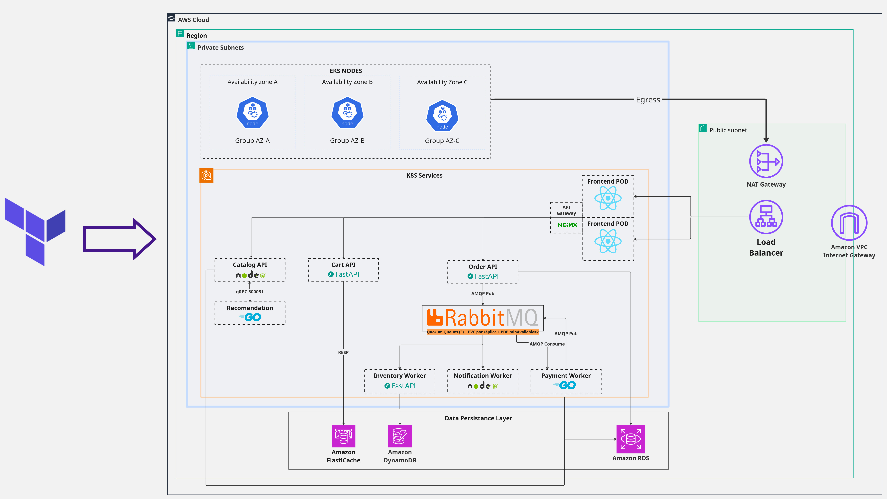
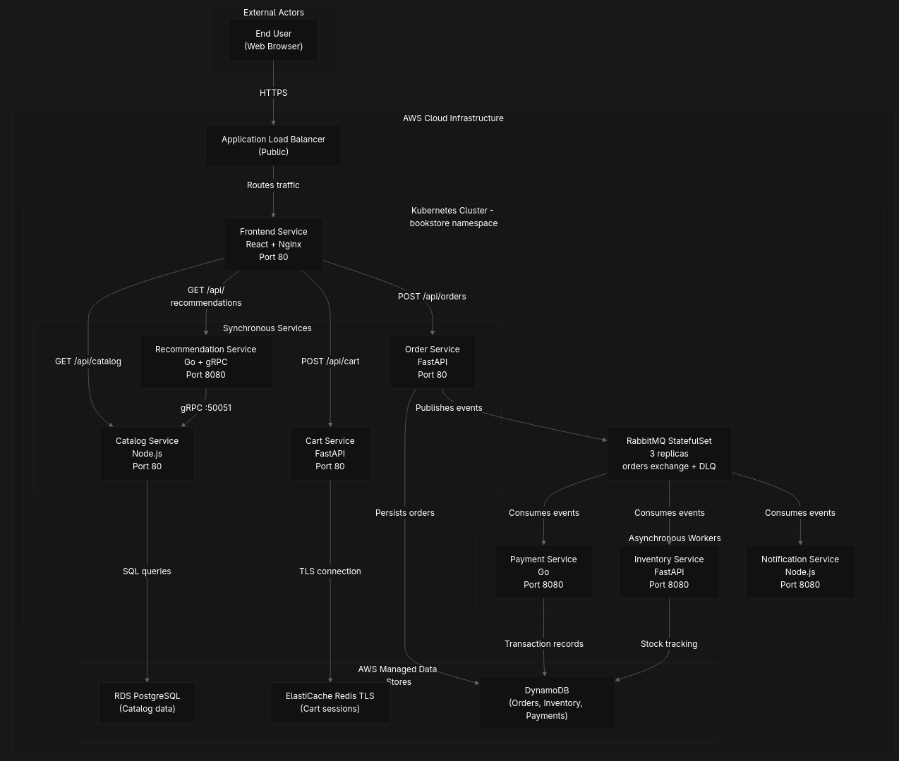
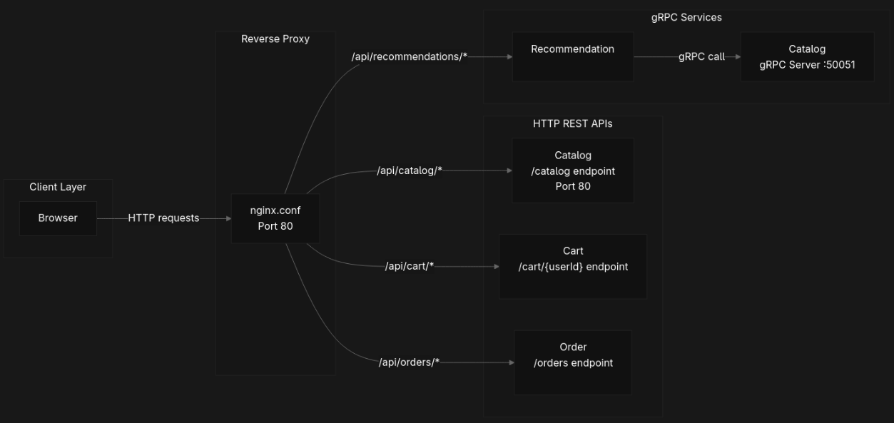
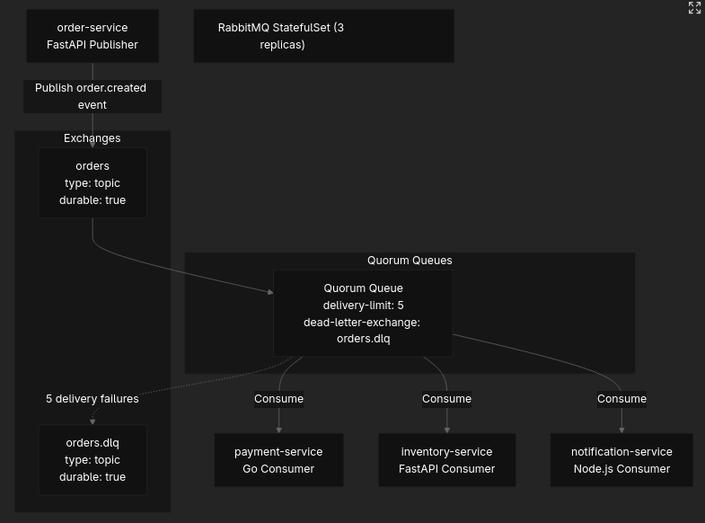
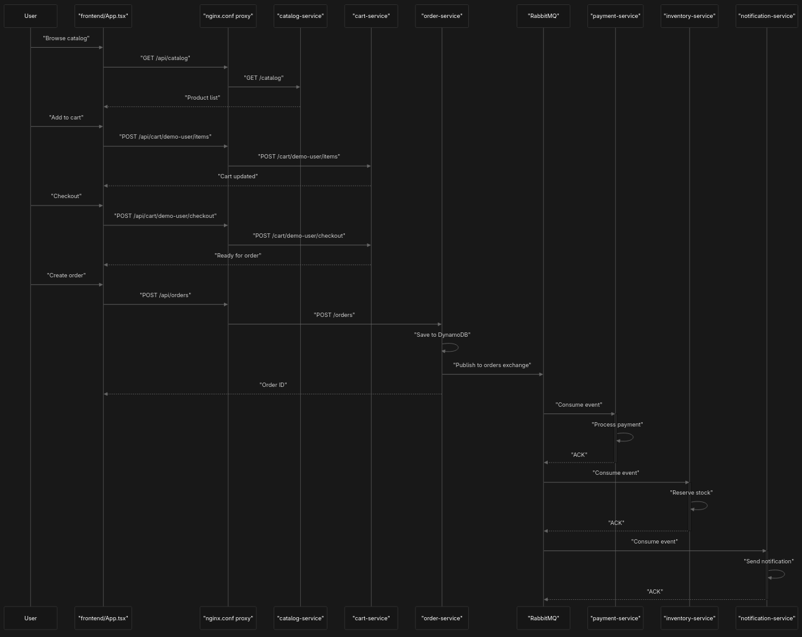
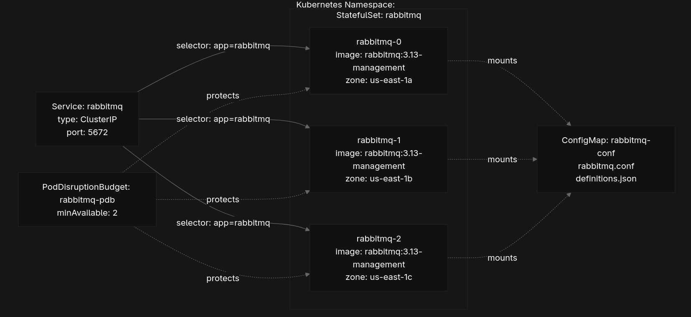
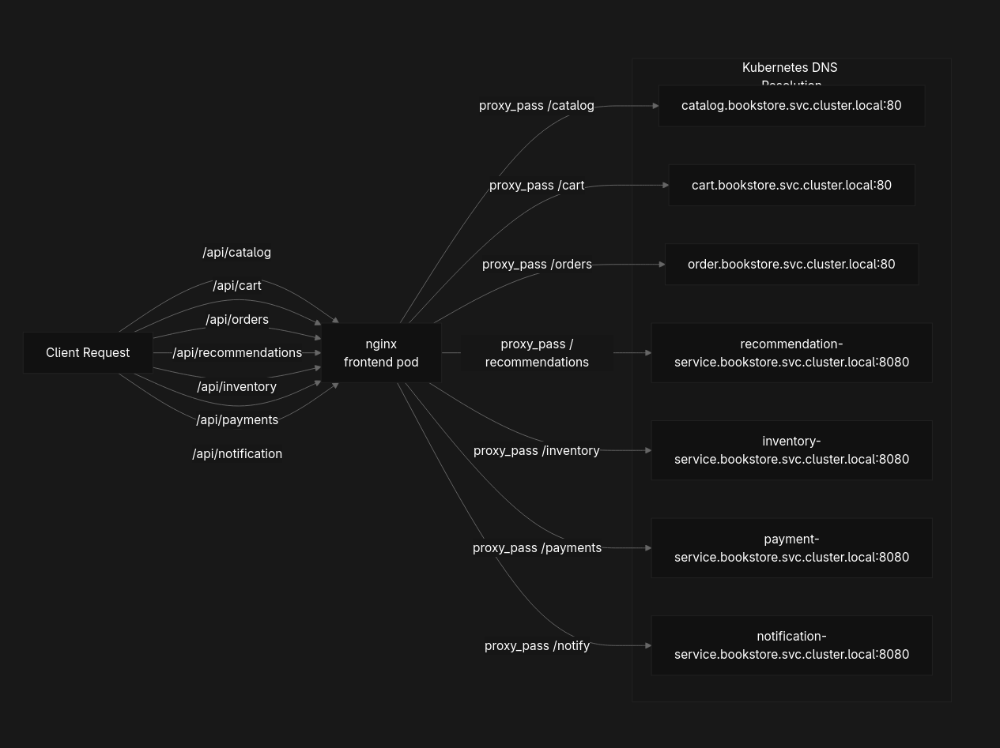
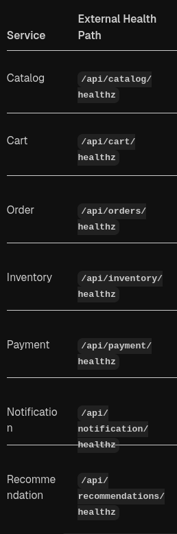

# K8Shop

K8Shop is a demonstration e-commerce platform that implements a complete bookstore with product catalog, shopping cart, order processing, payment handling, inventory management, and customer notifications. Is intended for the course Distributed Systems in EAFIT University, Medellín Antioquia by David Londoño Palacio and Sebastián Uribe.

The system is designed to showcase cloud-native patterns including:

- **Microservices decomposition** with domain-driven service boundaries
- **Polyglot architecture** using Node.js, Python/FastAPI, and Go based on service requirements
- **Event-driven architecture** with RabbitMQ for asynchronous processing
- **Multiple data storage patterns** (PostgreSQL, Redis, DynamoDB) optimized per service
- **Zero-trust networking** with Kubernetes NetworkPolicies
- **Infrastructure as Code** using Terraform for AWS resource provisioning

The application serves end users through a React-based web frontend that communicates with backend microservices via HTTP and gRPC APIs.




## Table of Contents

- [Architecture Overview](#architecture-overview)
  - [Microservices](#microservices)
  - [Data Store Characteristics](#data-store-characteristics)
- [Communication Patterns](#communication-patterns)
  - [Synchronous Communication](#synchronous-communication)
  - [Asynchronous Communication](#asynchronous-communication)
  - [Order Creation Flow](#order-creation-flow)
- [Infrastructure](#infrastructure)
  - [RabbitMQ Setup](#rabbitmq-setup)
  - [Kubernetes Resource Organization](#kubernetes-resource-organization)
  - [Network Policies](#network-policies)
- [Deployment](#deployment)
  - [Health Check Endpoints](#health-check-endpoints)
  - [High Availability Features](#high-availability-features)
  - [Service Exposure](#service-exposure)
- [Development](#development)
  - [Prerequisites](#prerequisites)
  - [Local Development](#local-development)
  - [Project Structure](#project-structure)
  - [Database Initialization](#database-initialization)

## Architecture Overview

### Microservices

| Service | Technology | Data Store | Communication | Purpose |
|---------|------------|----------------|------------|---------------|---------|
| **frontend** | React + Vite + Nginx | None | HTTP REST → Services | Web user interface for the bookstore |
| **catalog-service** | Node.js + Express |  PostgreSQL (schema: `catalog`) | HTTP REST, gRPC, RabbitMQ (producer) | Product catalog and management |
| **inventory-service** | Python + FastAPI | DynamoDB (`bookstore-inventory`) | HTTP REST, RabbitMQ (consumer/producer) | Stock level management and tracking |
| **cart-service** | Python + FastAPI |  Redis (ElastiCache) | HTTP REST | Shopping cart session management |
| **order-service** | Python + FastAPI |  PostgreSQL (schema: `order`) | HTTP REST, RabbitMQ (producer/consumer) | Order processing and management |
| **payment-service** | Go (net/http) | PostgreSQL (schema: `payment`) | HTTP REST, RabbitMQ (consumer/producer) | Payment transaction processing |
| **notification-service** | Node.js + Express | None | RabbitMQ (consumer only) | Email/SMS notification dispatch |
| **recommendation-service** | Go (net/http) | None (queries catalog via gRPC) | HTTP REST, gRPC (client) | Product recommendation engine |

### Infrastructure
- **Container Orchestration**: Kubernetes (EKS on AWS)
- **Message Broker**: RabbitMQ 3.13 (StatefulSet with clustering)
- **Databases**: 
  - PostgreSQL 15 (RDS Multi-AZ)
  - Redis 7.x (ElastiCache with TLS)
  - DynamoDB (On-Demand capacity)
- **Infrastructure as Code**: Terraform 1.5+
- **Container Registry**: Amazon ECR

### Data Store Characteristics

| Service | Data Store | Purpose | Access Pattern | Durability |
|---------|------------|---------|----------------|------------|
| `catalog` | PostgreSQL (RDS) | Product catalog (SKU, title, price, tags, stock) | Relational queries, joins | Persistent, backup enabled |
| `cart` | Redis (ElastiCache TLS) | User session state, cart line items | Key-value by user ID | In-memory with TTL expiration |
| `order` | PostgreSQL (RDS) | Order records with items, totals, status | Relational queries by order ID | Persistent, backup enabled |
| `inventory` | DynamoDB | Stock levels per SKU | Key-value by SKU, atomic counters | Persistent, eventually consistent |
| `payment` | PostgreSQL (RDS) | Payment transaction records | Relational queries by payment ID | Persistent, backup enabled |
| `recommendation` | None (queries catalog via gRPC) | Product suggestions based on catalog | Read-only gRPC calls | N/A |
| `notification` | None | Notification dispatch (fire-and-forget) | Stateless event processing | N/A |

> **Note:** The system uses multiple database schemas within a single PostgreSQL RDS instance for cost optimization while maintaining logical separation between services.

## Communication Patterns

### Synchronous Communication

Services communicate synchronously via HTTP REST APIs for user-facing operations and critical data retrieval.



### Asynchronous Communication

Event-driven communication via RabbitMQ for decoupled, reliable message passing between services.



### Order Creation Flow

Sequence diagram showing the complete order creation workflow across multiple microservices.



## Infrastructure

### RabbitMQ Setup

RabbitMQ is deployed as a highly available StatefulSet with clustering enabled.

**Deployment Specifications:**

| Property | Value | Description |
|----------|-------|-------------|
| **Name** | `rabbitmq` | StatefulSet and Service name |
| **Namespace** | `bookstore` | Deployment namespace |
| **Replicas** | 3 | Number of RabbitMQ pods for HA |
| **Image** | `rabbitmq:3.13-management` | Official RabbitMQ image with management plugin |
| **Service Type** | ClusterIP | Internal cluster access only |
| **AMQP Port** | 5672 | Message broker protocol port |
| **Management Port** | 15672 | Web-based management UI |
| **Anti-Affinity** | `topology.kubernetes.io/zone` | Spreads pods across availability zones |
| **PDB Min Available** | 2 | Ensures at least 2 replicas during disruptions |

**RabbitMQ Configuration:**




### Kubernetes Resource Organization

Kubernetes manifests are organized by deployment order and logical grouping:

| File Pattern | Resource Type | Purpose |
|-------------|---------------|---------|
| `00-namespace-and-networkpolicies.yaml` | Namespace, Default NetworkPolicy | Foundation and default-deny security |
| `10-rabbitmq.yaml` | StatefulSet, Service, ConfigMap, PDB | Message broker with HA |
| `20-networkpolicies-allow.yaml` | NetworkPolicies | Allow-list communication rules |
| `30-services-internal-nlb.yaml` | Services (LoadBalancer) | Internal NLB for cross-VPC access |
| `40-cart-service.yaml` | Deployment, HPA, PDB | Cart service deployment |
| `40-catalog-service.yaml` | Deployment, HPA, PDB | Catalog service deployment |
| `40-inventory-service.yaml` | Deployment, HPA, PDB | Inventory service deployment |
| `40-notification-service.yaml` | Deployment, HPA, PDB | Notification service deployment |
| `40-order-service.yaml` | Deployment, HPA, PDB | Order service deployment |
| `40-payment-service.yaml` | Deployment, HPA, PDB | Payment service deployment |
| `40-recommendation-service.yaml` | Deployment, HPA, PDB | Recommendation service deployment |
| `50-frontend.yaml` | Deployment, Service | Frontend application |



### Network Policies

The system implements **zero-trust networking** with NetworkPolicies:

1. **Default Deny**: All ingress traffic is denied by default (`00-namespace-and-networkpolicies.yaml`)
2. **Allow-list Rules**: Only explicitly permitted communication paths are allowed (`20-networkpolicies-allow.yaml`)
3. **Pod-to-Pod Isolation**: Services can only communicate with authorized dependencies
4. **RabbitMQ Access Control**: Only message-producing/consuming services can reach RabbitMQ

## Deployment

### Health Check Endpoints

All microservices expose standardized health check endpoints for Kubernetes probes:

| Service | Health Endpoint | Port | Response |
|---------|-----------------|------|----------|
| All services | `/healthz` | 8080 (or 80 for frontend) | `{"ok": true}` |



**Probe Configuration:**
- **Readiness Probe**: Initial delay 5s, checks if service is ready to accept traffic
- **Liveness Probe**: Initial delay 10s, restarts pod if unhealthy

### High Availability Features

- **Replicas**: Each service runs with 2-3 replicas for redundancy
- **Pod Disruption Budgets (PDB)**: Minimum 2 pods available during voluntary disruptions
- **Topology Spread Constraints**: Pods distributed across availability zones
- **Pod Anti-Affinity**: Pods spread across different nodes to avoid single points of failure
- **Horizontal Pod Autoscaling (HPA)**: Auto-scaling based on CPU/memory metrics
- **Rolling Updates**: Zero-downtime deployments with `maxUnavailable: 0`

### Service Exposure

Services are exposed internally via:
- **ClusterIP Services**: For intra-cluster communication (pod-to-pod)
- **Internal NLB (Network Load Balancer)**: For cross-VPC access from frontend or external services
  
**AWS Load Balancer Annotations:**
```yaml
service.beta.kubernetes.io/aws-load-balancer-type: "nlb"
service.beta.kubernetes.io/aws-load-balancer-internal: "true"
service.beta.kubernetes.io/aws-load-balancer-nlb-target-type: "ip"
service.beta.kubernetes.io/aws-load-balancer-healthcheck-protocol: "HTTP"
service.beta.kubernetes.io/aws-load-balancer-healthcheck-path: "/healthz"
service.beta.kubernetes.io/aws-load-balancer-cross-zone-enabled: "true"
```

## Development

### Prerequisites

- Kubernetes cluster (EKS recommended for AWS deployment)
- Terraform >= 1.0
- kubectl
- Docker
- AWS CLI (for AWS deployment)

### Local Development

See individual service README files in `microservices/*/README.md` for development setup instructions.

### Project Structure

```
K8Shop/
├── docs/                          # Documentation and diagrams
├── frontend/                      # React web application
│   ├── Dockerfile                # Production Nginx container
│   ├── src/                      # React source code
│   └── package.json
├── infra/
│   ├── k8s/                      # Kubernetes manifests
│   │   ├── 00-namespace-and-networkpolicies.yaml
│   │   ├── 10-rabbitmq.yaml
│   │   ├── 20-networkpolicies-allow.yaml
│   │   ├── 30-services-internal-nlb.yaml
│   │   ├── 40-*-service.yaml    # Service deployments
│   │   └── 50-frontend.yaml
│   └── terraform/                # AWS infrastructure as code
│       ├── eks.tf               # EKS cluster configuration
│       ├── vpc.tf               # VPC and networking
│       ├── db-rds.tf            # PostgreSQL RDS instance
│       ├── db-elasticache.tf    # Redis cluster
│       └── db-dynamo.tf         # DynamoDB tables
├── microservices/
│   ├── cart-service/             # Shopping cart service (Python/FastAPI)
│   ├── catalog-service/          # Product catalog service (Node.js)
│   ├── inventory-service/        # Inventory management (Python/FastAPI)
│   ├── notification-service/     # Notification dispatch (Node.js)
│   ├── order-service/            # Order processing (Python/FastAPI)
│   ├── payment-service/          # Payment processing (Go)
│   └── recommendation-service/   # Recommendations (Go)
└── scripts/                      # Utility scripts for DB setup and seeding
    ├── db-bootstrap.sh
    ├── db-bootstrap.sql
    ├── db-seed.sql
    └── seed-dynamodb.sh
```

### Database Initialization

```bash
# Bootstrap PostgreSQL schemas
./scripts/db-bootstrap.sh

# Seed initial data
./scripts/db-seed.sql

# Seed DynamoDB tables
./scripts/seed-dynamodb.sh
```

### Deployment Steps

1. **Provision Infrastructure**:
   ```bash
   cd infra/terraform
   terraform init
   terraform plan
   terraform apply
   ```

2. **Deploy to Kubernetes**:
   ```bash
   # Apply in order
   kubectl apply -f infra/k8s/00-namespace-and-networkpolicies.yaml
   kubectl apply -f infra/k8s/10-rabbitmq.yaml
   kubectl apply -f infra/k8s/20-networkpolicies-allow.yaml
   kubectl apply -f infra/k8s/30-services-internal-nlb.yaml
   kubectl apply -f infra/k8s/40-*.yaml
   kubectl apply -f infra/k8s/50-frontend.yaml
   ```

3. **Verify Deployment**:
   ```bash
   kubectl get pods -n bookstore
   kubectl get svc -n bookstore
   ```
